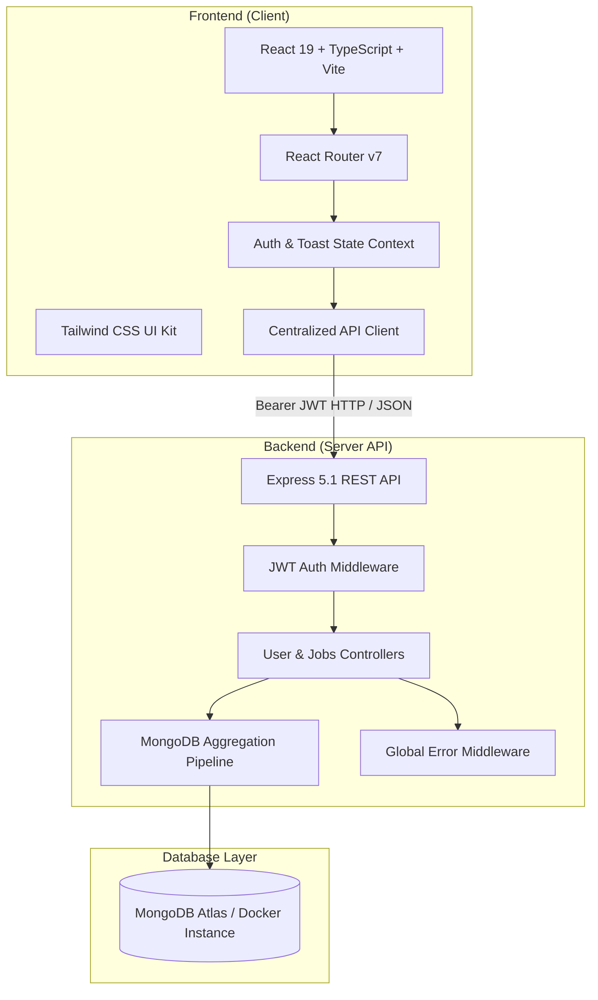

# 🚀 JobTracker — Full-Stack Application Tracking & Pipeline Management System

<div align="center">


**An intelligent, data-driven full-stack job application tracker engineered to organize interviews, visualize recruitment pipelines with Kanban, analyze conversion rates, and accelerate career search.**

[Key Features](#-key-features) • [System Architecture](#-system-architecture) • [Live Views](#-ui--views) • [API Documentation](#-api-documentation) • [Quick Start](#-quick-start) • [Docker Deployment](#-docker-deployment) • [Testing](#-automated-testing)

</div>

---

## 🌟 Key Features

### 📋 Interactive Pipeline Management
- **Kanban Board View**: Organize applications dynamically across customizable recruitment stages: `Applied`, `Interviewing`, `Offer`, `Rejected`, and `Hired`.
- **Card & Table Views**: Switch seamlessly between interactive visual cards, a high-density tabular view with inline status editing, and column boards.
- **Dynamic Status Progression**: Instant stage shifting with live server updates and UI state synchronization.

### 📊 Real-Time Analytics & KPI Dashboard
- **Conversion Rate Metrics**: Real-time calculation of interview conversion % and offer acceptance ratios.
- **Application Velocity**: 6-month historical activity histogram for tracking consistency.
- **Workplace Distribution**: Categorization across `Remote`, `Hybrid`, and `On-site` opportunities.
- **Interview Countdown**: Proactive reminders for upcoming interview rounds.

### 🔍 Advanced Search, Filtering & Data Portability
- **Full-Text Instant Search**: Search across company names, job titles, locations, and personal interview notes.
- **Multi-Parameter Filtering**: Filter by status and workplace type; sort by date, company name, or salary.
- **One-Click CSV Export**: Export your complete application history into standard CSV format for external backup and spreadsheets.

### 🛡️ Production-Grade Security & Performance
- **JWT Authentication**: Stateless token-based auth with configurable expiration and automatic client-side session renewal.
- **Safe Password Storage**: Strong salted bcrypt hashing.
- **Centralized Error Handling**: Standardized JSON error schema with typed HTTP response codes.
- **Optimized MongoDB Indexing**: Compound indexing on `userId`, `status`, and `createdAt` for sub-millisecond querying.

---

## 🏗 System Architecture



---

## 📁 Repository Structure (Monorepo)

```
jobtracker/
├── .github/
│   └── workflows/
│       └── ci.yml                 # Automated CI workflow (lint, build, test)
├── backend/                       # Express + TypeScript API Server
│   ├── src/
│   │   ├── config/env.ts          # Centralized configuration & environment loader
│   │   ├── controllers/           # Business logic (users, jobs, stats aggregation)
│   │   ├── middlewares/           # JWT auth & centralized error handlers
│   │   ├── models/                # Mongoose Schemas (User, Job)
│   │   ├── routes/                # REST endpoints (/api/user, /api/jobs)
│   │   ├── __tests__/             # Backend unit & integration test suites
│   │   ├── app.ts                 # Express application configuration
│   │   └── server.ts              # Database connection & HTTP listener
│   ├── Dockerfile                 # Multi-stage production container
│   ├── package.json
│   └── tsconfig.json
├── frontend/                      # React 19 + TypeScript + Vite SPA
│   ├── src/
│   │   ├── components/            # UI components (Kanban, Navbar, FilterBar, JobCard)
│   │   ├── context/               # AuthContext & ToastContext providers
│   │   ├── layouts/               # MainLayout with header & footer
│   │   ├── pages/                 # Landing, Dashboard, Jobs, Details, Auth, Profile
│   │   ├── services/api.ts        # Typed API Client with request interceptors
│   │   ├── types/                 # TypeScript data contracts & interfaces
│   │   ├── __tests__/             # Component & unit tests
│   │   ├── App.tsx                # App routing & protected route guards
│   │   └── main.tsx
│   ├── nginx.conf                 # Production Nginx reverse proxy configuration
│   ├── Dockerfile                 # Multi-stage SPA container with Nginx
│   ├── package.json
│   └── vite.config.ts
├── docker-compose.yml             # Full-stack Docker compose configuration
├── package.json                   # Monorepo workspaces & concurrent script runner
└── README.md
```

---

## 🔌 API Documentation

All routes are prefixed with `/api`. Protected routes require `Authorization: Bearer <token>`.

### Authentication Endpoints
| Method | Endpoint | Description | Auth Required |
| :--- | :--- | :--- | :---: |
| `POST` | `/api/user/signup` | Register a new account | No |
| `POST` | `/api/user/login` | Authenticate and obtain JWT token | No |
| `GET` | `/api/user/profile` | Get logged-in user profile | **Yes** |
| `PATCH` | `/api/user/profile` | Update name or target career role | **Yes** |

### Job Application Endpoints
| Method | Endpoint | Description | Auth Required |
| :--- | :--- | :--- | :---: |
| `GET` | `/api/jobs` | Get all applications (supports search, status, sorting) | **Yes** |
| `GET` | `/api/jobs/stats` | Compute analytics & KPI pipeline breakdown | **Yes** |
| `POST` | `/api/jobs` | Create a new job application record | **Yes** |
| `GET` | `/api/jobs/:id` | Get details for a single application | **Yes** |
| `PATCH` | `/api/jobs/:id` | Update status, compensation, dates, or notes | **Yes** |
| `DELETE` | `/api/jobs/:id` | Permanently remove an application | **Yes** |

### System Endpoints
| Method | Endpoint | Description | Auth Required |
| :--- | :--- | :--- | :---: |
| `GET` | `/api/health` | Service health status and uptime ping | No |

---

## ⚡ Quick Start

### Prerequisites
- [Node.js](https://nodejs.org/) (v18 or higher, v22 recommended)
- [MongoDB](https://www.mongodb.com/) (local instance or free MongoDB Atlas URI)

### 1. Clone & Install
```bash
git clone <your-repo-url>
cd jobtracker

# Install all monorepo dependencies in one command
npm install
```

### 2. Configure Environment Variables
Copy the example environment files:
```bash
cp backend/.env.example backend/.env
cp frontend/.env.example frontend/.env
```

Edit `backend/.env` with your MongoDB connection string (defaults to `mongodb://127.0.0.1:27017/jobtracker`).

### 3. Run in Development Mode
Run both backend and frontend concurrently with live reloading:
```bash
npm run dev
```

- **Frontend Application**: `http://localhost:5173`
- **Backend API Server**: `http://localhost:5000`
- **Health Check**: `http://localhost:5000/api/health`

---

## 🐳 Docker Deployment

Spin up the entire stack (MongoDB 7.0 + Node Backend + Nginx React Frontend) in isolated containers with a single command:

```bash
docker-compose up --build
```

Access the application at `http://localhost:3000`.

---

## 🧪 Automated Testing

Execute the test suites across both backend and frontend workspaces:

```bash
# Run all tests
npm test

# Run backend tests only (Health, Auth, Middlewares)
npm run test:backend

# Run frontend tests only (Component renders, FilterBar, JobCard)
npm run test:frontend
```

---

## 👨‍💻 Author & Portfolio

- **Developer**: Muhammad Saad
- **License**: MIT
- **GitHub**: [@muhammadsaad-dev](https://github.com/muhammadsaad-dev)

---

<div align="center">
  <sub>Built with ❤️ using modern web technologies. Star this repository if you find it helpful!</sub>
</div>
